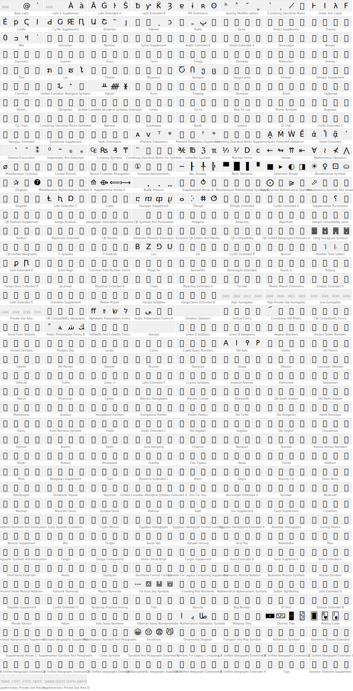

# unicode-palette

Unicode character visualization tool - Generate grid-based character maps as SVG/PNG.

## Unicode Block Data

This repository includes pre-generated Unicode block data (Unicode 16.0.0, 338 blocks) that can be used directly:

| File                                                               | Description                              |
| ------------------------------------------------------------------ | ---------------------------------------- |
| [data/unicode-blocks.json](data/unicode-blocks.json)               | Full block data with ranges              |
| [data/unicode-blocks.csv](data/unicode-blocks.csv)                 | Tabular format for spreadsheets/analysis |
| [data/unicode-blocks.schema.json](data/unicode-blocks.schema.json) | JSON Schema for validation               |

Each block includes: name, display name, code point range, defined/unassigned counts, and character ranges.


```rb
require 'json'
block = JSON.parse(File.read('data/unicode-blocks.json'))['blocks'].find{|b| b['name']=='Bopomofo'}\
puts (0...20).map{|i| (block['blockStart']+i).chr('UTF-8')}.join
# ㄀㄁㄂㄃㄄ㄅㄆㄇㄈㄉㄊㄋㄌㄍㄎㄏㄐㄑㄒㄓ
#  Note:  ㄀~㄄ are unassigned

# filter out unassigned
puts block['ranges'].flat_map{|r| (r['start']..r['end']).to_a}.first(20).pack('U*')
# ㄅㄆㄇㄈㄉㄊㄋㄌㄍㄎㄏㄐㄑㄒㄓㄔㄕㄖㄗㄘ
```

```sh
$ jq -r '.blocks[] | select(.name=="Tifinagh") | [range(.blockStart; .blockStart+20)] | implode' unicode-blocks.json
ⴰⴱⴲⴳⴴⴵⴶⴷⴸⴹⴺⴻⴼⴽⴾⴿⵀⵁⵂⵃ

jq -r '.blocks[] | select(.name=="Superscripts_And_Subscripts") | [.ranges[] | range(.start; .end+1)] | .[:20] | implode' data/unicode-blocks.json
⁰ⁱ⁴⁵⁶⁷⁸⁹⁺⁻⁼⁽⁾ⁿ₀₁₂₃₄₅
```


```js
const data = require('./data/unicode-blocks.json')
const block = data.blocks.find(b => b.name === 'Greek_And_Coptic')
const toChar = cp => String.fromCodePoint(cp)
const range = (n) => [...Array(n).keys()]

// Simple: from blockStart (may include unassigned holes)
range(20).map(i => toChar(block.blockStart + i)).join('')
// ͰͱͲͳʹ͵Ͷͷ͸͹ͺͻͼͽ;Ϳ΀΁΂΃

// Using ranges: only defined characters (no holes)
block.ranges.flatMap(r => range(r.end - r.start + 1)).slice(0, 20)
  .map(i => toChar(r.start + i)).join('')
// ͰͱͲͳʹ͵Ͷͷͺͻͼͽ;Ϳ΄΅Ά·ΈΉ
```

## Features

### Implemented

- [x] SVG generation with Unicode characters in grid layout
- [x] Character category detection (printable, control, surrogate, unassigned, private)
- [x] XML escape handling
- [x] GNU Unifont support for consistent character width
- [x] Console output mode (dump-scripts)
- [x] **Script tile mode** - For each Unicode block, select 4 representative characters (from defined ranges, quartile positions) and arrange in 4x1 tiles
- [x] **Full Unicode block data** - 338 blocks from `@unicode/unicode-16.0.0`
- [x] **Function abstraction** - Export reusable functions with configurable options
- [x] **PNG export** - Convert SVG to PNG using canvas

### WIP / Planned

- [ ] **Browser support** - Run in browser environment
- [ ] **Random sampling mode** - Select random characters (excluding undefined), e.g., 30x20 grid

## Install

```bash
pnpm add unicode-palette
```

## CLI

```bash
# Print to console (default: U+0000-00FF)
unicode-palette print

# Print specific range
unicode-palette print 3040-309F

# Print by block name
unicode-palette print Hiragana

# Output to file (auto-detect format by extension)
unicode-palette print 0000-00FF -o output.svg
unicode-palette print 0000-00FF -o output.png

# With options
unicode-palette print 0000-00FF -c 32 -b  # 32 cols, with background colors

# List available block names
unicode-palette print --list

# Generate script tiles
unicode-palette tiles -o tiles.svg -c 8
```

### Example Output

```
$ unicode-palette print 3040-309F
 ぁあぃいぅうぇえぉおかがきぎく
ぐけげこごさざしじすずせぜそぞた
だちぢっつづてでとどなにぬねのは
ばぱひびぴふぶぷへべぺほぼぽまみ
むめもゃやゅゆょよらりるれろゎわ
ゐゑをんゔゕゖ  ゙゚゛゜ゝゞゟ

$ unicode-palette print Hiragana -c 10
 ぁあぃいぅうぇえぉ
おかがきぎくぐけげこ
ごさざしじすずせぜそ
ぞただちぢっつづてで
とどなにぬねのはばぱ
ひびぴふぶぷへべぺほ
ぼぽまみむめもゃやゅ
ゆょよらりるれろゎわ
ゐゑをんゔゕゖ  ゙
゚゛゜ゝゞゟ
```

## Font Setup

GNU Unifont is required for consistent character display.

```bash
bash scripts/setup-font.sh
```

Or install to system:

```bash
cp fonts/unifont.otf ~/Library/Fonts/  # macOS
```

## Architecture

```
data/
  unicode-blocks.json       # Single source of truth (338 blocks with ranges)
  unicode-blocks.csv        # CSV export
  unicode-blocks.schema.json # JSON Schema
src/
  index.ts                  # Main exports (browser compatible)
  node.ts                   # Node.js exports (file I/O + canvas)
  cli/                      # CLI commands
  core/                     # Unicode blocks, category detection
  render/                   # SVG/character generation
  node-io/                  # File I/O, PNG generation
```

## API

```typescript
import {
  generateSvgString,
  generateScriptTilesSvg,
  UNICODE_BLOCKS,
  BMP_BLOCKS,
  type GridOptions,
} from 'unicode-palette'

// Generate SVG string
const svg = generateSvgString({
  cols: 64,
  rows: 104,
  cellSize: 16,
})

// Script tiles (4x1 per block)
const tiles = generateScriptTilesSvg({
  cellSize: 32,
  cols: 8,
})

// Access Unicode blocks
console.log(UNICODE_BLOCKS.length) // 338
console.log(BMP_BLOCKS.length) // 164
```

### Node.js (File I/O)

```typescript
import {
  renderSvgToFile,
  renderScriptTilesToFile,
  renderPngToFile,
} from 'unicode-palette/node'

renderSvgToFile('./output/unicode.svg')
renderScriptTilesToFile('./output/tiles.svg')
renderPngToFile('./output/unicode.png')
```

## Regenerate Block Data

Block data is generated from `@unicode/unicode-16.0.0`:

```bash
pnpm generate:data
```

## References

- [GNU Unifont](https://unifoundry.com/unifont/)
- [@unicode/unicode-16.0.0](https://www.npmjs.com/package/@unicode/unicode-16.0.0)
- [ISO 15924 (Scripts)](https://unicode.org/iso15924/)
- [Unicode Character Database](https://www.unicode.org/ucd/)

## Script Tiles Preview



## License

MIT © [anozon](https://anozon.me)
